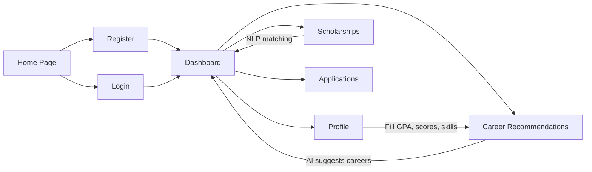

# Path2Prep — App Flow & Feature Guide

## How the App Works

Path2Prep is a **student career guidance and scholarship matching platform**. It helps students discover career paths based on their profile and find relevant international scholarships.

## User Flow



---

## Pages & What They Do

### 1. Home (`/`)
Public landing page. Links to Login and Register.

### 2. Register (`/register`)
Creates an account and **auto-logs in** (returns JWT tokens). Fields: username, email, password, full name, country.

### 3. Login (`/login`)
Accepts **email** + password. Returns JWT access/refresh tokens stored in `localStorage`.

### 4. Dashboard (`/dashboard`)
The main hub after login. Shows:
- **Stats**: Recommended scholarships count, applications count, unread notifications, profile completion
- **Quick Actions**: "Get Recommendations" button (triggers ML engine), "View Matches" link
- **Top Scholarship Matches**: NLP-matched scholarships from your profile

### 5. Profile (`/profile`)
Fill in your academic info. **This is the key step** — the ML and NLP engines use this data:

| Field | Purpose |
|-------|---------|
| GPA | Academic strength signal for career/scholarship matching |
| Degree Level | Bachelor's, Master's, PhD |
| Major | Field of study for career alignment |
| Country | Home country |
| Target Country | Where you want to study (scholarship matching) |
| IELTS/TOEFL Score | Language proficiency for scholarship eligibility |
| GRE/GMAT Score | Standardized test scores |

### 6. Career Recommendations (`/career-recommendations`)
Triggered from Dashboard → "Get Recommendations". The ML engine:
1. Reads your profile (GPA, major, skills, interests)
2. Runs ensemble models (Random Forest, KNN, Neural Network)
3. Falls back to rule-based matching if ML models aren't trained
4. Returns top 3 career matches with confidence scores

### 7. Scholarships (`/scholarships`)
Browse all approved scholarships. The Dashboard also triggers **NLP matching** which scores scholarships by relevance to your profile (country, degree level, field of study).

### 8. Applications (`/applications`)
Track your scholarship applications. Status: Not Started → In Progress → Submitted → Accepted/Rejected.

---

## Sample Data Created

### 12 Careers
| Career | Category | Avg Salary | Growth |
|--------|----------|-----------|--------|
| Software Engineer | STEM | $105K | High |
| Data Scientist | STEM | $120K | High |
| Machine Learning Engineer | STEM | $130K | High |
| Cybersecurity Analyst | STEM | $100K | High |
| Civil Engineer | STEM | $88K | Medium |
| Business Analyst | Business | $85K | Medium |
| Product Manager | Business | $115K | High |
| Financial Analyst | Business | $80K | Medium |
| Marketing Manager | Business | $92K | Medium |
| UX/UI Designer | Arts | $90K | High |
| Environmental Scientist | Science | $72K | Medium |
| Healthcare Administrator | Healthcare | $95K | High |

### 10 International Scholarships
Fulbright (USA), Chevening (UK), DAAD (Germany), Erasmus Mundus (Europe), Australia Awards, KGSP (South Korea), Swiss Excellence, MEXT (Japan), Gates Cambridge (UK), New Zealand Scholarships. All `is_approved=True` with future deadlines.

### Notifications
Welcome notifications for all existing users: "Complete Your Profile" and "New Scholarships Available!".

---

## Testing the Full Flow

1. **Login** with your account
2. **Go to Profile** → Fill in GPA (e.g. 3.5), Degree Level (Master's), Major (Computer Science), Target Country (USA), IELTS (7.0), GRE (320)
3. **Save Profile**
4. **Go to Dashboard** → Click **"Get Recommendations"** → See AI career suggestions
5. **Go to Dashboard** → Notice **scholarship matches** auto-populated
6. **Go to Scholarships** → Browse all 10 scholarships
7. **Notifications** badge shows unread count on Dashboard header

---

## Architecture Summary

| Layer | Technology | Notes |
|-------|-----------|-------|
| Frontend | React 19 + Redux + TypeScript | `localhost:3000` |
| Backend | Django 5 + DRF + SimpleJWT | `localhost:8000` |
| Database | SQLite (dev) / PostgreSQL (prod) | |
| ML Engine | Scikit-learn (ensemble models) | Falls back to rule-based if not trained |
| NLP Matcher | Keyword/profile-based scoring | Matches scholarships to user profile |

## Seed Data Command

To re-seed data anytime:
```bash
python manage.py seed_data
```
